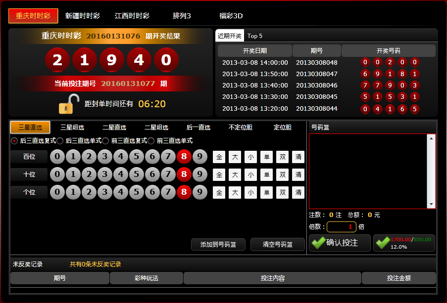

<html>
	<head>
	    <meta http-equiv="content-type" content="text/html; charset=utf-8" />
	    <meta name="viewport" content="width=device-width, initial-scale=1.0" />
	    <title>{{ page.title }}</title>
		<meta name="keywords" content="时时彩,时时彩制作,时时彩开发,时时彩研发,时时彩平台制作,时时彩平台开发,时时彩娱乐平台制作,时时彩娱乐平台开发,时时彩网" />
    	<meta name="description" content="业界专业的娱乐平台开发团队" />

		<link rel="fluid-icon" href="/fluidicon.png" />
	    <link rel="apple-touch-icon" sizes="57x57" href="/images/apple-touch-icon-114.png" />
	    <link rel="apple-touch-icon" sizes="114x114" href="/images/apple-touch-icon-114.png" />
	    <link rel="apple-touch-icon" sizes="72x72" href="/images/apple-touch-icon-144.png" />
	    <link rel="apple-touch-icon" sizes="144x144" href="/images/apple-touch-icon-144.png" />
	    <link rel="icon" type="image/x-icon" href="/images/favicon.ico" />

	    <link rel="stylesheet" href="//cdn.bootcss.com/bootstrap/3.3.5/css/bootstrap.min.css">
	    <link rel="stylesheet" href="/css/index.css" />

	    
	    
	    
	    
	    

	</head>
	<body>
		

			<ul>
				<li style="background-image: url('../images/lunbo_bg1.png');">
					

						<h1>时时彩专业定制</h1>
						
业界专业的娱乐平台开发团队 
						业界权威的时时彩源码提供团队 
						深度定制大型娱乐平台、我们专注、我们高效
						

					

				</li>
				<li style="background-image: url('../images/lunbo_bg2.png');">
					

						<h1>顶级团队、极致体验</h1>
						
我们的团队成员均超过8年开发经验。对安全、性能有极高的造诣 
						创意与技术完美结合，每一个项目均为按需定制 
						手机端、Web端、PC客户端深度定制
						

					

				</li>
			</ul>
		

		

			<ul class="wrap">
				<li class="service1">
					<b>网站建设</b>
					
源代码开发，功能开发，源码+服务器+域名一条龙，让客户省时省心

				</li>
				<li class="service2">
					<b>模板定制</b>
					
平台模板定制，根据需求定制极致体验的界面UI

				</li>
				<li class="service3">
					<b>仿站</b>
					
根据客户提供的目标网站，模仿出相同功能和界面的网站

				</li>
				<li class="service4">
					<b>网站维护</b>
					
提供源源不断的技术支持，您不需要担心网站开发出来技术走人的尴尬情况

				</li>
			</ul>
		

		

			<h2>案例</h2>
			

			

				

				
				

			

		

		

			<h2>合作流程</h2>
			<ol>
				<li>
					

						<h3>联系我们</h3>
						
请 QQ 联系我们，1020304029，初步洽谈需求

					

				</li>
				<li>
					

						<h3>需求确定</h3>
						
细化需求，双方确认需求，评估时间

					

				</li>
				<li>
					

						<h3>预付定金</h3>
						
预付30%定金（不议价）

					

				</li>
				<li>
					

						<h3>成品预览验收</h3>
						
完成开发，在客户指定的环境运行无 Bug

					

				</li>
				<li>
					

						<h3>付余款完成交易</h3>
						
在客户验收完成需一次性付清余款，我们提交源码给客户

					

				</li>
			</ol>
		

		

			

				<h2>联系我们</h2>
				
QQ:1020304029

			

		

		

			
&copy;&nbsp;Copyright 2014 - {{site.time | date:"%Y"}} - ZKTeam

		

	</body>
</html>
